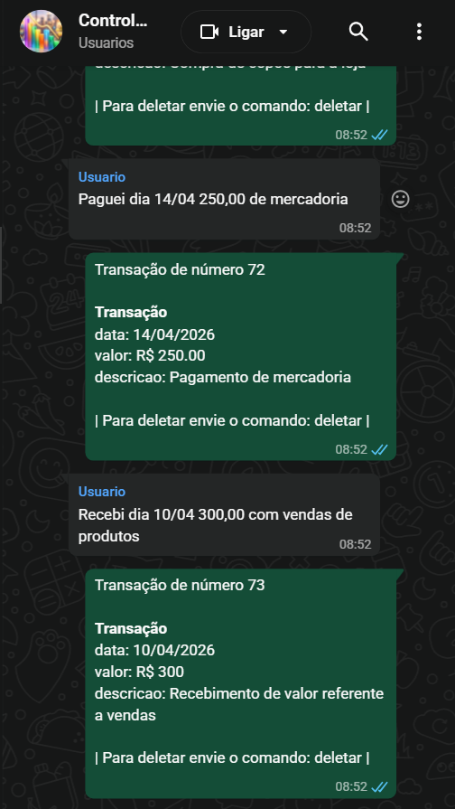

# ControleGastos

Painel financeiro em Django + Supabase REST + Chart.js, com integração WhatsApp via N8N (extração de transações por LLM).

## Demonstração

### Dashboard web


Resumo do mês, filtros por categoria/tipo, gráficos e CRUD completo de transações — tudo numa tela só.

### Lançamento por WhatsApp (N8N + LLM)



**Zero planilha, zero formulário.** Mande uma mensagem no WhatsApp ("paguei 47,90 no mercado no crédito em 3x") e o fluxo do N8N usa o Gemini para extrair valor, categoria, tipo, data e parcelamento, gravando direto na tabela `transacoes` do Supabase. O dashboard reflete o lançamento na hora — sem digitar em tabela, sem abrir o app.

## Stack

- **Django 5**
- **Supabase** acessado via REST/PostgREST com `supabase-py`
- **Chart.js 4**
- **N8N** como pipeline de entrada por WhatsApp (fluxo em `ControleGastosN8N.json`)

## Rodar localmente

```bash
python -m venv .venv
.venv\Scripts\activate         # Windows
# source .venv/bin/activate    # Linux/Mac

pip install -r requirements.txt
cp .env.example .env           # edite com suas credenciais
python manage.py migrate
python manage.py runserver
```

Abra `http://localhost:8000/`.

## Variáveis de ambiente

| Variável | Obrigatório | Descrição |
|---|---|---|
| `SUPABASE_URL` | sim | URL do projeto Supabase (ex.: `https://xxxx.supabase.co/`) |
| `SUPABASE_KEY` | sim | Chave `anon` ou `service_role` |
| `DJANGO_SECRET_KEY` | sim em prod | `python -c "import secrets; print(secrets.token_urlsafe(64))"` |
| `DJANGO_DEBUG` | recomendado | `False` em produção |
| `DJANGO_ALLOWED_HOSTS` | sim em prod | Hosts separados por vírgula. Ex.: `gastos.seudominio.com`
| `DJANGO_CSRF_TRUSTED_ORIGINS` | sim em prod | Com esquema. Ex.: `https://gastos.seudominio.com` |
| `PORT` | opcional | Porta de escuta (default 8000) |


## Integração N8N (WhatsApp)

O fluxo `ControleGastosN8N.json` recebe mensagens via Evolution API, passa pelo Gemini com os prompts de `IAPrompt/`, e grava direto na tabela `transacoes` do Supabase. O Django lê dessa mesma tabela — não precisa adaptação.

## Estrutura

```
controlegastos/        # settings, urls, wsgi
transacoes/            # app principal
  ├── repo.py          # acesso Supabase REST
  ├── services.py      # filtros, parcelamento, resumo analítico
  ├── views.py         # dashboard + endpoints JSON
  ├── forms.py         # validação
  ├── models.py        # constantes (TipoTransacao, categorias)
  └── templates/transacoes/dashboard.html
static/                # CSS + JS
ControleGastosN8N.json # fluxo do n8n (não é executado pelo Django)
IAPrompt/              # prompts da LLM no n8n
```

## Endpoints

| Método | URL | Descrição |
|---|---|---|
| GET | `/` | Dashboard |
| GET | `/api/transacoes/` | Lista com filtros (`mes`, `data_de`, `data_ate`, `tipo`, `categoria`) |
| POST | `/api/transacoes/criar/` | Cria 1..N transações (parcelamento) |
| PUT | `/api/transacoes/<id>/` | Atualiza |
| DELETE | `/api/transacoes/<id>/excluir/` | Exclui |
| GET | `/api/resumo/` | Totais + dados dos gráficos |
